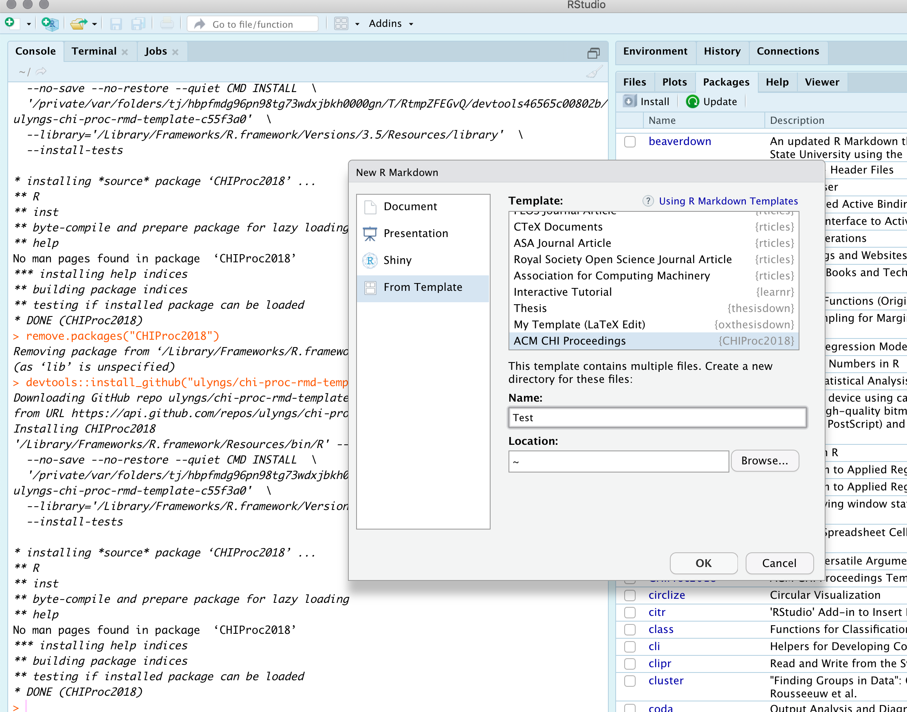
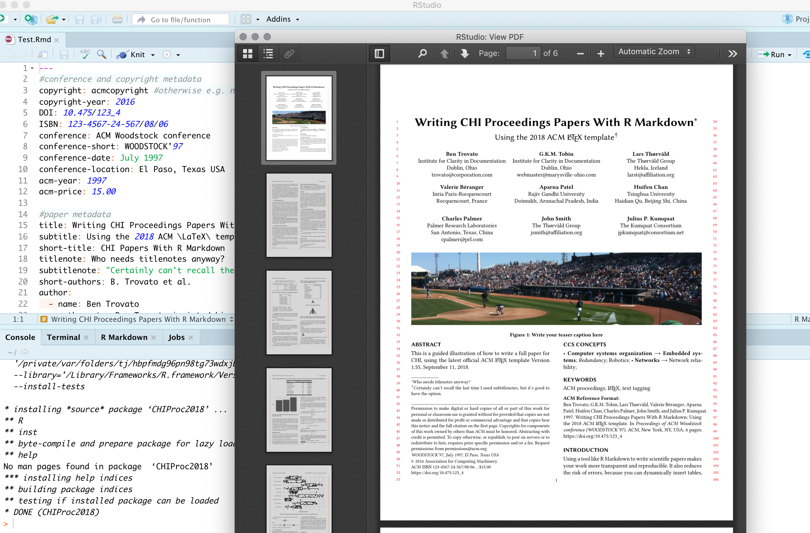

```{r setup, include=FALSE}
knitr::opts_chunk$set(echo = FALSE)
```

So, I previously wrote at [great length](https://ulriklyngs.com/blog/acm-articles-with-r-markdown) about how to use the [ACM Master Article LaTeX templates](https://www.acm.org/publications/proceedings-template) (or any other LaTeX templates) in tandem with R Markdown to write transparent and reproducible papers.

To make it speedy and easy in practice specifically in relation to the [ACM CHI Conference](https://sigchi.org), I ended up creating two R packages which provides R Markdown templates for submissions in the latest formats for [ACM CHI Proceedings](https://github.com/ulyngs/chi-proc-rmd-template) as well as [ACM CHI Extended Abstracts](https://github.com/ulyngs/chi-ea-rmd-template).





For now, these packages can be installed using the `devtools` for R:
```r
# The package isn't on CRAN yet - install the development version from GitHub:
# install.packages("devtools")
devtools::install_github("ulyngs/chi-proc-rmd-template")
 #and/or
devtools::install_github("ulyngs/chi-proc-ea-template")
``` 

As described in the **README.md** files on the two github repos, installing these packages will add two new templates to the available R Markdown templates in RStudio. The sample content has lots of examples (adapted and developed from the sample content included with the ACM Master Articles) that should make it easy for anyone interested to get up to speed on how to write CHI submissions in R Markdown!